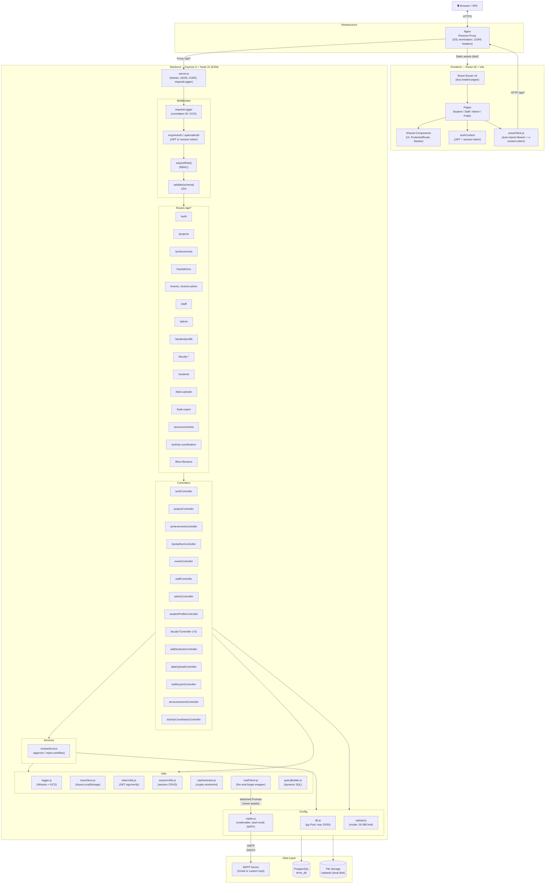
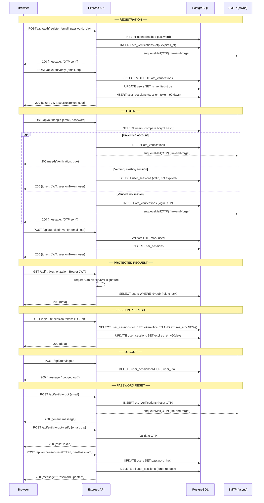
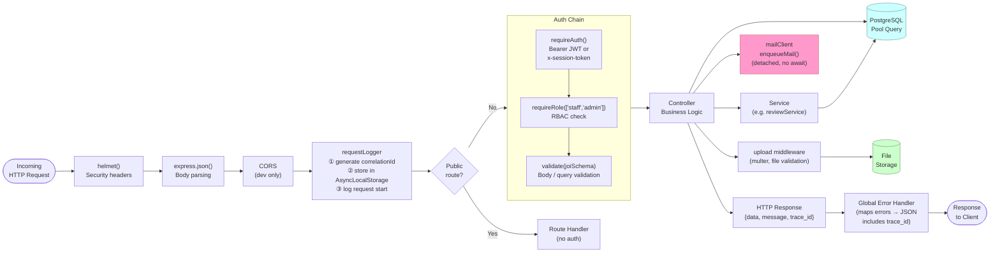
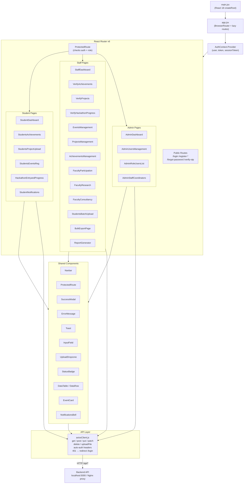
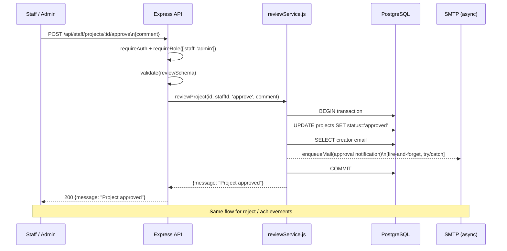
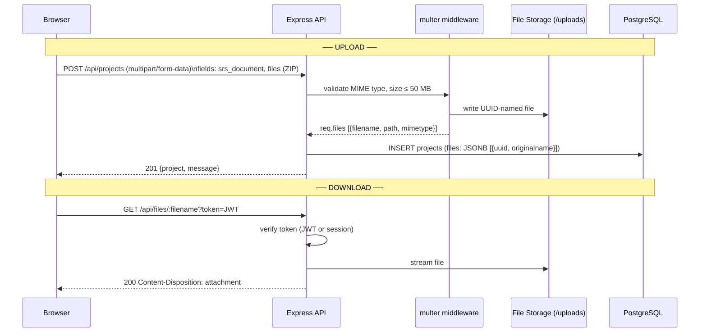
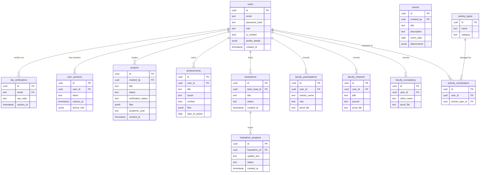
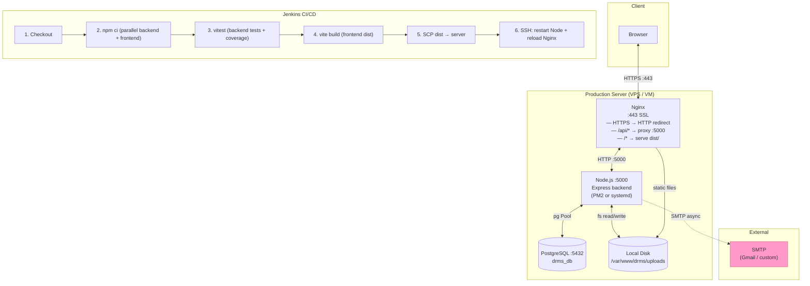
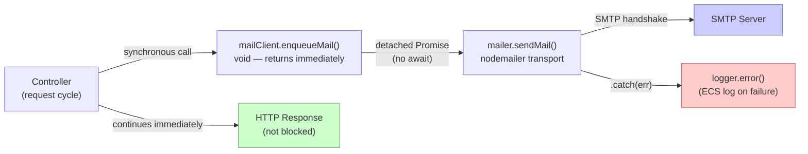

# Department Record Management System — Architecture

---

## 1. System Overview

---

## 2. Authentication & Session Flow

---

## 3. Request Middleware Pipeline

---

## 4. Frontend Component Tree

---

## 5. Review / Approval Workflow

---

## 6. File Upload & Retrieval

---

## 7. Database Schema Map

---

## 8. Infrastructure & Deployment

---

## 9. Async Mail (Fire-and-Forget) Detail

